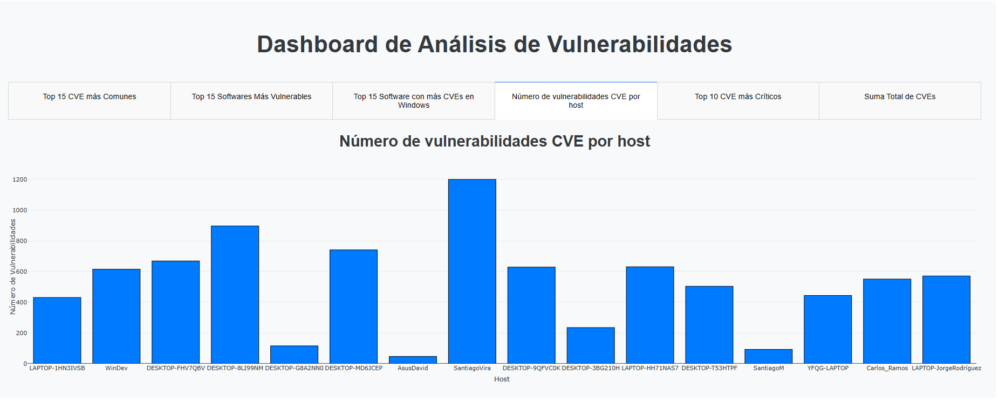

# Dashboard de Análisis de Vulnerabilidades CVE

## Descripción

Este proyecto consiste en el desarrollo de un **Dashboard interactivo para el análisis de vulnerabilidades CVE**, construido con **Python, Dash, Plotly y MongoDB**.

La aplicación consulta información almacenada en una base de datos MongoDB, procesa los registros de software y vulnerabilidades asociadas y presenta los resultados mediante diferentes visualizaciones interactivas.

El objetivo del proyecto es facilitar el análisis de las vulnerabilidades identificadas, permitiendo visualizar los **CVE más frecuentes**, los **softwares con mayor cantidad de vulnerabilidades**, los registros relacionados con **Windows**, las vulnerabilidades por **host**, el **Top 10 de CVE** y la **cantidad total de vulnerabilidades registradas**.

---

## Vista general del Dashboard

El dashboard está organizado en **seis pestañas principales**, permitiendo consultar diferentes indicadores relacionados con las vulnerabilidades almacenadas en la base de datos.

### Funcionalidades principales

- Top 15 CVE más comunes.
- Top 15 softwares con mayor número de vulnerabilidades.
- Top 15 softwares con más CVE en sistemas Windows.
- Número de vulnerabilidades CVE identificadas por host.
- Top 10 CVE más críticos.
- Suma total de CVE registrados.

---

## Tecnologías utilizadas

| Tecnología | Uso dentro del proyecto |
|---|---|
| Python | Lenguaje principal para el desarrollo de la aplicación |
| Dash | Creación de la aplicación web interactiva |
| Plotly | Generación de gráficos interactivos |
| MongoDB | Almacenamiento de la información analizada |
| PyMongo | Conexión entre Python y MongoDB |
| Jupyter Notebook | Procesamiento y análisis de los datos |
| Matplotlib | Biblioteca para visualización de datos |

---

## ¿Cómo funciona el proyecto?

```text
                ┌──────────────────┐
                │     MongoDB      │
                │ Base de Datos de │
                │ Vulnerabilidades │
                └────────┬─────────┘
                         │
                         ▼
                ┌──────────────────┐
                │     PyMongo      │
                │ Conexión y       │
                │ consulta de datos│
                └────────┬─────────┘
                         │
                         ▼
                ┌──────────────────┐
                │ Procesamiento de │
                │ software, CVE y  │
                │ hosts en Python  │
                └────────┬─────────┘
                         │
                         ▼
                ┌──────────────────┐
                │ Dash + Plotly    │
                │ Generación de    │
                │ gráficas         │
                └────────┬─────────┘
                         │
                         ▼
                ┌──────────────────┐
                │    Dashboard     │
                │   Interactivo    │
                └──────────────────┘
```

La aplicación obtiene la información desde MongoDB y posteriormente procesa los documentos para calcular los diferentes indicadores mostrados en el dashboard.

Cada host contiene información relacionada con los softwares instalados y las vulnerabilidades CVE asociadas. A partir de estos registros, Python realiza conteos, agrupaciones y ordenamientos para generar las visualizaciones.

---

## Estructura de los datos analizados

```text
nombre_equipo
software
    ├── nombre
    └── cves
         ├── CVE
         └── Sistema_Operativo_Afectado
```

De forma simplificada:

```text
HOST
│
├── Software 1
│   ├── CVE-XXXX-XXXX
│   ├── CVE-XXXX-XXXX
│   └── CVE-XXXX-XXXX
│
├── Software 2
│   ├── CVE-XXXX-XXXX
│   └── CVE-XXXX-XXXX
│
└── Software 3
    └── CVE-XXXX-XXXX
```

Esto permite analizar las vulnerabilidades desde diferentes perspectivas: por **CVE**, por **software**, por **sistema operativo** y por **equipo o host**.

---

## Análisis implementados

### 1. Top 15 CVE más Comunes

Se consultan los documentos de MongoDB, se recorren los softwares y sus CVE asociados, se cuenta la frecuencia de cada identificador y se ordenan de mayor a menor, seleccionando los 15 más frecuentes. El resultado se presenta en una gráfica de barras horizontal.


### 2. Top 15 Softwares Más Vulnerables

Identifica los softwares con mayor cantidad de vulnerabilidades asociadas, ordenándolos de mayor a menor y seleccionando los 15 principales. Se muestra mediante una gráfica interactiva de dispersión.

### 3. Top 15 Software con más CVEs en Windows

Se enfoca en las vulnerabilidades cuyo sistema operativo afectado es `Windows`, agrupando y ordenando los resultados por software para identificar cuáles concentran más vulnerabilidades en este sistema.

### 4. Número de vulnerabilidades CVE por Host

Para cada host se suman las vulnerabilidades de todos sus softwares asociados, obteniendo el total por equipo. El resultado se presenta en una gráfica de barras.

```text
Host
 │
 ├── Software A → Número de CVE
 ├── Software B → Número de CVE
 ├── Software C → Número de CVE
 │
 ▼
Suma total de vulnerabilidades del Host
```



### 5. Top 10 CVE más Críticos

Se recorren todos los registros, softwares y CVE asociados, incrementando un contador por identificador, y se seleccionan los 10 con mayor número de ocurrencias.


### 6. Suma Total de CVEs

Calcula la cantidad total de vulnerabilidades CVE presentes en todos los registros procesados.

```text
Todos los registros → Todos los softwares → Todos los CVE → Suma Total de CVEs
```

---

## Funcionamiento de las pestañas

El dashboard utiliza un sistema de pestañas de Dash. Cuando el usuario selecciona una pestaña, se ejecuta un callback (`render_content()`) que identifica la pestaña activa, ejecuta la función de análisis correspondiente y actualiza la gráfica mostrada.

---

## Estructura del proyecto

```text
dashboard-analisis-vulnerabilidades/
│
├── Dasboard_Johan_Rojas-Orlando_Monsalve.py
│
├── MONGODB_SOFTWARE_Johan_Rojas_Orlando_Monsalve.ipynb
│
├── requirements.txt
│
├── .gitignore
│
├── README.md
│
└── imagenes/
    ├── Grafica_Numero_de_vulnerabilidades_CVE_por_host.png
    ├── Grafica_Top_10_CVES_mas_Criticos.png
    └── Grafica_top_15_cves_mas_comunes.png
```

---

## Instalación

### 1. Clonar el repositorio

```bash
git clone URL_DEL_REPOSITORIO
```

También puedes descargar el proyecto desde GitHub con **Code → Download ZIP**.

### 2. Ingresar al directorio del proyecto

```bash
cd dashboard-analisis-vulnerabilidades
```

### 3. Crear un entorno virtual

**Windows**
```bash
python -m venv venv
venv\Scripts\activate
```

**Linux / macOS**
```bash
python3 -m venv venv
source venv/bin/activate
```

### 4. Instalar las dependencias

```bash
pip install -r requirements.txt
```

---

## Archivo requirements.txt

```text
dash
plotly
pymongo
matplotlib
```

---

## Configuración de MongoDB

La aplicación utiliza MongoDB como fuente de información. Para evitar publicar información sensible en GitHub, la cadena de conexión debe configurarse mediante variables de entorno:

```text
MONGO_HOST
MONGO_DATABASE
MONGO_COLLECTION
```

Ejemplo conceptual:

```text
MONGO_HOST = cadena_de_conexion_a_mongodb
MONGO_DATABASE = nombre_de_la_base_de_datos
MONGO_COLLECTION = nombre_de_la_coleccion
```

> ⚠️ **Importante sobre seguridad:** no se deben subir al repositorio público usuarios, contraseñas, cadenas de conexión ni tokens de MongoDB. Estos datos deben mantenerse fuera del código mediante variables de entorno.

---

## Ejecución del Dashboard

```bash
python "Dasboard_Johan_Rojas-Orlando_Monsalve.py"
```

La aplicación inicia un servidor local en el puerto `8050`, accesible desde:

```text
http://127.0.0.1:8050/
```

---

## Objetivo del proyecto

Este proyecto aplica conceptos de análisis de datos, procesamiento de información, bases de datos NoSQL (MongoDB), Python, visualización de datos, desarrollo de dashboards interactivos y análisis de vulnerabilidades CVE.

---

## Autores

**Johan Rojas**
**Orlando Monsalve**

---

## Vista previa del Dashboard

### Top 15 CVE más Comunes


### Número de vulnerabilidades CVE por host


### Top 10 CVE más Críticos


---

## Proyecto académico

Proyecto desarrollado para el análisis y visualización de información relacionada con vulnerabilidades CVE mediante el uso de **Python, MongoDB, Dash y Plotly**.
